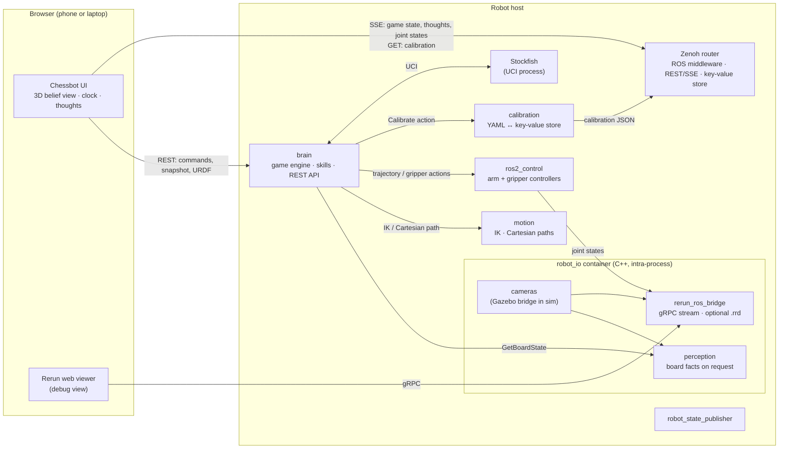
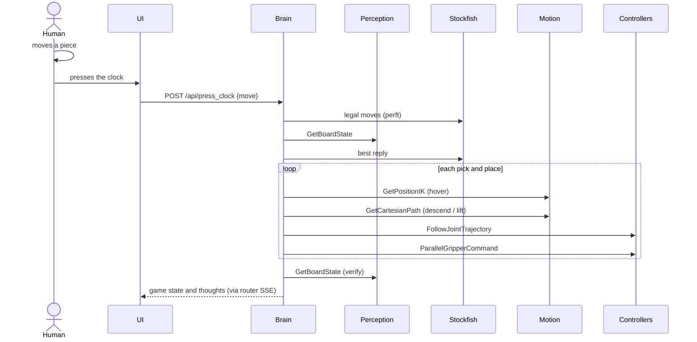

# Design

How chessbot is put together, and why. For every interface and its exact type, see
[interfaces.md](interfaces.md). For skill contracts, see
[skills](../src/chessbot_brain/skills/README.md).

## Goals

- **Play a real game** against a human on a physical board, with a low-cost arm (SO-101 first).
- **Any arm, any board.** Hardware sits behind ros2_control, and the board is described by
  calibration. A different arm or board changes configuration, not code (within the arm's reach).
- **Swappable capabilities.** Perception, motion planning, control and calibration each sit
  behind a contract. A better implementation (MoveIt, a learned grasp policy, a VLM) drops in
  without changing the brain.
- **Observable by default.** Every decision is narrated, every sensor stream can be recorded,
  and the UI shows what the robot believes.
- **A data flywheel.** Recorded games become training data for perception and, later, learned
  manipulation policies.
- **Simulation first.** The whole stack runs against Gazebo with the same interfaces as the
  real robot.

## Principles

1. **Contracts before code.** Interfaces are agreed from requirements before implementation.
   Standard ROS interfaces are reused wherever they exist (`moveit_msgs`, `control_msgs`,
   `sensor_msgs`). Custom ones exist only for game state and perception, are minimal, and
   use enums rather than strings.
2. **Observations are events; inference is a service; motion is an action.** Nothing polls for
   state. Expensive inference (reading the board) runs only on request.
3. **One writer per piece of state.** The brain owns the game. The calibration node owns the
   calibration. Everyone else reads.
4. **Heavy data stays in C++ and in one process.** Camera frames, perception and the Rerun
   bridge are composed into one container with intra-process communication, so images are
   passed by pointer, never serialised. C++ nodes with many callbacks use the callback-group
   events executor.
5. **No extra bridges.** The browser reads ROS topics through the Zenoh router the middleware
   already uses. Visualisation reuses Rerun's own viewer.
6. **Safety is hardware.** A physical stop cuts servo power. Software pause and park are
   ordinary operations, not safety functions.
7. **Permissive licences only.** Everything linked, vendored or shipped is Apache-2.0
   compatible. Stockfish (GPL) runs as a separate process over UCI. See [licensing.md](licensing.md).

## System overview

All ROS traffic goes through the Zenoh router (`rmw_zenoh`). The router also runs the REST
plugin, so the browser can subscribe to any topic over Server-Sent Events, and an in-memory
storage that acts as a shared key-value store.

## Components

| Component | Package | Language | Role |
|---|---|---|---|
| Brain | `chessbot_brain` | Python | Owns the game: position, moves, clocks, phase. Composes capabilities into skills. Publishes game state and a readable thought feed. Serves the REST API and the UI. |
| Perception | `chessbot_perception` | C++ | Turns overhead camera frames into board facts (`GetBoardState`: empty / white / black per square), only when asked. |
| Move detection | `chessbot_move_detection` | Python | Serves `DetectMove`: which move the human played, given the position, the legal moves, and the board before and after. Two interchangeable implementations, one reading occupancy and one reading pixels with a model. |
| Reasoning | `chessbot_inference` | Python | Serves the `Reason` service from Gemma 4 in `llama-server`, on this host or another. Advises; never decides. |
| Motion | `chessbot_motion` | Python | IK and Cartesian paths behind MoveIt's standard services, using Pinocchio. |
| Control | ros2_control | C++ | `joint_trajectory_controller` for the arm, `parallel_gripper_action_controller` for the gripper, `joint_state_broadcaster`. Gazebo, mock or real hardware behind the same controllers. |
| Calibration | `chessbot_calibration` | Python | Owns where the board is relative to the robot: loads the YAML profile, primes the key-value store, and stores measurements taken by the guided workflow (`SetCalibration`). |
| Recording | [`rerun_ros_bridge`](https://github.com/Yadunund/rerun_ros_bridge) (external) | C++ | Generic ROS 2 → Rerun bridge in its own repository, pinned in `chessbot.repos`. Streams to the Rerun viewer over gRPC, and archives to `.rrd` when asked. |
| UI | `chessbot_web` | JS | Plain HTML, CSS and JavaScript, no build step. three.js for the 3D view. |
| Description | `chessbot_description` | URDF | SO-101 with overhead and wrist cameras, ros2_control tags, simulation world. |
| Bringup | `chessbot_bringup` | XML launch | Launch files and configuration. |
| Interfaces | `chessbot_interfaces` | IDL | `GameState`, `Thought`, `BoardState`, `BoardObservation`, `GetBoardState`, `DetectMove`, `Reason`, `SetCalibration`, `Calibrate`. |

## The brain

The brain is a game engine and an orchestrator in one process. It is a **client** of every
capability, and exposes only its own state.

- **Rules and moves.** Stockfish runs as a separate process. The brain asks it for legal moves
  (`go perft 1`), check (`d`) and its reply (`go movetime`, with `UCI_Elo` for strength).
  Board bookkeeping (FEN, castling, en passant, promotion effects) is our own code.
- **Phases.** `idle → setup → human_turn → reading_board → thinking → moving → verifying →
  human_turn`, with `needs_help`, `calibrating` and `game_over`. One job runs at a time;
  commands during a job are rejected with HTTP 409.
- **Thought feed.** Every step is narrated on `/chessbot/thoughts` (`perceive`, `decide`, `plan`,
  `act`, `verify`, `recover`, `explain`), which the UI shows and Rerun records.
- **Geometry.** Squares and graveyard slots become robot-frame positions from the calibration
  profile, read from the key-value store. Nothing else about the board is hard-coded.

### A turn

The human's move is read from the camera (see [Reading the human's move](#reading-the-humans-move)); a typed
move is used only when the camera can't tell.

### Skills

A skill is a sequence composed from capabilities that does one physical thing and returns or
raises. Skills keep no state and never wait on a human; the game logic decides what a failure
means. Each has a `SKILL.md` contract in the Agent Skills format, so a reasoning model can load
them later.

`execute_chess_move` → `transfer` (captures to the graveyard first, then the move, then the
castling rook) → `pick` / `place` → hover above the target at the highest reachable transit
height, straight-line descent, gripper, straight-line lift.

Skills are composed in code today. The same contracts allow a behaviour tree, or code written
by a reasoning model, to compose them later.

## Calibration and the key-value store

The calibration profile says where the board is in the robot's base frame: the a1 outer
corner, the board's yaw, and the square size.

- The calibration node is the only writer. On startup it loads `~/.chessbot/calibration.yaml`
  (or writes nominal values) and puts it into the router's key-value store as JSON under
  `chessbot/kv/calibration`.
- Every reader (the brain, the UI) gets it from the store, never from disk.
- A new calibration overwrites both the YAML and the stored value. The profile carries a
  `version`, so a reader can reject an incompatible one.

The nominal placement puts the robot at the rank-8 edge (it plays black, the human sits
opposite), with the near edge 10 cm from the pan axis. That keeps every square and graveyard
slot reachable with a near-vertical approach; `tools/dev/board_reach.py` checks it against
the real IK.

## Motion

- **IK** solves for gripper position plus approach direction with bounded least squares over
  the joint limits (Pinocchio forward kinematics, SciPy solver). Seeds come from sampled
  configurations; if a strictly vertical approach fails, the tilt tolerance relaxes to 25°.
- **Cartesian paths** interpolate straight lines and solve IK along them, seeded by the
  previous point.
- Both are served through `moveit_msgs` services, so MoveIt could replace this node without
  changing the brain.

## Reading the human's move

1. **Where squares are:** perception projects a small patch just above each square centre into the overhead
   image, using what is already known: the board pose from the key-value store, the camera model from
   `camera_info` and the camera pose from TF. Nothing is detected in the image.
2. **What they look like:** whenever the human's turn begins (the robot has finished and parked, or a new
   game has started), the believed position can be trusted, so perception records each square's colour
   with its believed label, per square and pooled over light and dark squares.
3. **On the clock press:** the brain calls `GetBoardState` and grabs the camera frame, and sends both -
   together with the board it snapshotted when the turn was handed over - to `DetectMove`, along with the
   position and the moves the rules allow. The brain reads nothing itself: it supplies the facts, and
   accepts or ignores the one move that comes back.
4. **Which move:** `classic_detector` compares the observed occupancy with the occupancy each legal move
   would leave, weighted by confidence, and accepts the best only if it fits well and clearly beats the
   next. When two candidates tie, Gemma looks at the picture and chooses between them, subject to the
   decoy control: the same question asked again with the true candidates removed, and the
   answer discarded if the model still picks confidently.
5. **The other detector:** `gemma_detector` answers the same question from the two photographs alone. It is
   never asked to name a move - only which square a piece left and which it arrived on, which is a question
   about pixels rather than about chess - and the answer is resolved back to a legal move deterministically.
6. **Which one runs:** `move_detection:=classic|gemma` at launch, and `move_detection_service` on the brain.
   Both serve the same service, so the brain does not know or care which answered.
7. **When it can't tell:** the player types the move.

## Reasoning

Gemma 4 E4B (Apache-2.0, vision) runs in `llama-server` (llama.cpp) on the GPU machine
(`pixi run -e llm llm`). `chessbot_inference` serves `Reason` from it; any host can run either.
Deterministic components keep authority: the model advises, the caller decides, and without a model
server everything still works.

| Role | When | Output |
|---|---|---|
| Commentary | after each robot move, in the background | a sentence or two in the thought feed, marked model-generated, grounded in the moves played |
| Move tiebreak | the camera reading is ambiguous, or `gemma_detector` is the detector in use | a candidate move, or the squares a piece left and arrived on, or "unclear" (JSON schema). Believed only when confident, and only when the same question with the true answer removed is declined |
| Explain | (next) an illegal or odd move | a friendly sentence built from rules-engine facts |

## Seeing the robot's belief

The UI renders the brain's **belief world**, not camera images: what the robot thinks is on
the board, and where its arm is.

| What is drawn | Where it comes from |
|---|---|
| Board | calibration profile, read from the router's key-value store |
| Pieces | FEN from the game state |
| Captured pieces | the brain's graveyard, with each piece's slot |
| Arm | URDF and meshes served by the brain, posed by live `/joint_states` |

The same data drives three views: **3D** from the human's seat, **top down** with the arm drawn
translucent, and a flat **2D** board. The URDF loader is ours; rendering uses three.js.

When camera perception is implemented, squares where the camera disagrees with the belief can
be highlighted in the same view.

### How the browser gets data

No extra bridge process is involved:

- **Commands and snapshots:** the brain's REST API.
- **Live topics:** the Zenoh router's REST plugin streams any topic as Server-Sent Events. The
  UI decodes the CDR payloads itself (`cdr.js`) for `GameState`, `Thought` and `JointState`.
- **Calibration:** a plain HTTP GET on the key-value store.
- **Writes** go through the brain's REST API, not the router: `rmw_zenoh` ignores samples
  without its attachment metadata.

## Recording and visualisation

[`rerun_ros_bridge`](https://github.com/Yadunund/rerun_ros_bridge) lives in its own repository, since nothing in it is chessbot-specific; its README describes its architecture. It runs in the same container as the cameras, so frames reach it by pointer.

- It serves a gRPC stream that the stock Rerun web or native viewer connects to. `app.launch.xml`
  starts the viewer through the bridge's `viewer.launch.xml` (`viewer:=web|native|none`), and the
  UI's **Debug view** button opens the web viewer in a new tab.
- It logs the robot model (URDF through Rerun's importer, moved by `/tf`), images (with encoding
  and row-padding handling and optional downscaling), joint states, and any other topic as text
  (type discovered at runtime, rendered as YAML through ROS introspection).
- The layout is `config/chessbot.rbl`, generated by `src/chessbot_bringup/rerun/make_blueprint.py`
  (`pixi run rerun-blueprint`): the 3D scene takes most of the screen, with cameras, joint plots,
  thoughts and game state beside it.
- Everything is logged on one `ros_time` timeline from the node's clock: simulation time when
  `use_sim_time` is set, wall-clock time otherwise.
- Archiving to `.rrd` is off unless requested: `pixi run sim record:=true`.

Rerun recordings are the start of the data flywheel: paired camera frames, joint trajectories
and narrated skill calls.

## Simulation

Gazebo (gz sim) runs headless inside the `robot_io` container, with the ros_gz bridge as
another component. The robot uses `gz_ros2_control` with the same controllers as real
hardware, and the overhead and wrist cameras are simulated sensors. The world starts without a
board or pieces, so perception reports no board and the brain's belief is the only board.

`pixi run check` exercises every interface boundary. With `--e2e` it plays a game in simulation,
including an illegal move and captures.

### Motion testing

`tools/sim/scenario.py` measures what a motion does to the pieces, using Gazebo's own
transport rather than screenshots:

1. It sets the believed position (dev endpoint), then spawns the board and pieces from it:
   cylinders with the real set's 15 mm bases and heights up to the 42 mm king.
2. It runs an action: park, a demo transfer, or a human move followed by the robot's reply.
3. Contact sensors on the arm's moving links report every touch while the action runs.
4. It compares every piece with the belief afterwards.

A run fails on any contact other than the gripper on the piece being moved, on a stationary
piece that moved more than 2 mm or tipped, or on a moved piece more than 4 mm from its square.

Grasping follows from the gripper's measured geometry (`tools/dev/gripper_geometry.py`):
- **Grasp point:** it lies on the fixed jaw's inner surface. A pick stops the fixed jaw 2.5 mm
  from the piece, with the jaws open to 20 mm (piece plus 2.5 mm each side). A place centres the
  held piece on its square and releases it 3 mm above the board.
- **Jaw yaw:** at piece height the open gripper is a narrow strip, 13–16 mm wide and 53 mm long
  along the opening axis. For each pick and place the brain scores jaw yaws every 15° by the
  strip's clearance to the pieces it believes are there, using the outline below each
  neighbour's height, and tries the clearest first. The IK honours the tool's roll for this.
  If every yaw would overlap a piece, the skill refuses rather than knock pieces over.
- **Clearance limit:** in the starting position the best vertical grasp clears neighbours by
  only 3.0–4.2 mm, which is the limit of this gripper on 26 mm squares.
- **Moving:** the tool lifts straight up before any sideways move when it is low over the board.
  Cartesian moves are limited to 4 cm/s, and a trajectory counts as done only once the arm has
  arrived and stopped.
- **Park:** the arm swings to the side at transit height, then lies low along the board's near
  edge (`tools/dev/park_search.py --pan`).

Poses follow these fixed rules today. Because the belief is already turned into piece cylinders,
publishing them as a planning scene for collision-aware planning is a small step later.

## Real hardware

There is one launch file. `chessbot.launch.xml` brings up the application (`app.launch.xml`) over a
robot (`robot.launch.xml`), and `hardware` chooses what that robot is:

| `hardware:=` | The robot layer is |
|---|---|
| `gazebo` | Gazebo, which runs `ros2_control` itself through the plugin in the description, plus simulated cameras |
| `real` | `ros2_control` with `feetech_ros2_driver` over USB, plus `usb_cam` components for the cameras |
| `mock` | `ros2_control`'s mock hardware: no arm, no cameras, for checking an installation |

Everything above the robot is identical in all three, `use_sim_time` follows from the same flag, and the
cameras load into the io container either way, so frames reach perception and the Rerun bridge by
pointer. The real arm runs at a quarter of the simulated speed until motion has been tuned against it.

### Calibrating a rig

Nothing about a real rig can be assumed: the camera is mounted wherever it fits and the board is put
wherever there is room. So calibration is a guided workflow in the UI rather than a routine in the
code, and it interleaves what only the arm can measure with what only the person can say:

1. **The camera**, from the arm. The tool visits a dozen poses and opens its jaws at each. The jaws
   are the only thing that moves between two frames, so differencing them locates the gripper in the
   image without any marker, and a pinhole pose is fitted to where the gripper measurably was. The
   focal length is held fixed, because the poses a short arm can hold are nearly coplanar and a free
   focal length trades against the camera's height.
2. **The board**, from the person: they click its four corners in the photograph. Those pixels
   back-project onto the table plane, giving origin, rotation and square size. How far the four sides
   are from equal is reported as the check on both the clicks and the camera fit.
3. **Reach**, from IK: every square at grasping height, so a board out of reach is a sentence on
   screen rather than an arm straining at it.
4. **The park pose**, from the person: they jog the arm somewhere clear and save it.

The brain measures, because it already talks to the arm and the camera; the calibration node stores,
because it owns the profile and the key-value store everything else reads (`SetCalibration`).

The same Robot card jogs the tool in 5-20 mm steps and works the jaws, clamped into a box above the
table and within reach, since an uncalibrated rig has no idea where the board is. Setup:
[hardware.md](hardware.md).

## Deployment and compute

- Prototyping runs on one Linux desktop. The Pixi workspace targets linux-64, linux-aarch64 and
  osx-arm64.
- Any node can run on another machine by connecting to the same router, for example GPU
  inference on a separate box. That needs configuration, not code.
- Moving to smaller compute later is an optimisation, not a design constraint.

## Status and roadmap

**Working in simulation:** full games against Stockfish with legality checks; pick and place
across every square and graveyard slot, including captures and castling; the 3D belief UI;
the thought feed; the Rerun debug view.

**Next:**

- calibration measurement
- promotion piece swaps
- a vision-language model for reasoning, cheat checks and board disagreements
- a real SO-101 on the same stack
- recorded episodes toward learned manipulation

## Repository layout

| Path | Contents |
|---|---|
| `src/` | ROS 2 packages |
| `config/zenoh/` | router configuration |
| `tools/` | stack checks, reachability analysis, dev scripts |
| `docs/` | design, interfaces, licensing |
| `media` branch | README screenshots and GIFs, kept out of `main`'s history |
| `chessbot.repos` | pinned external sources (rerun_ros_bridge, SO-101 description, Stockfish), imported into `external/` |
